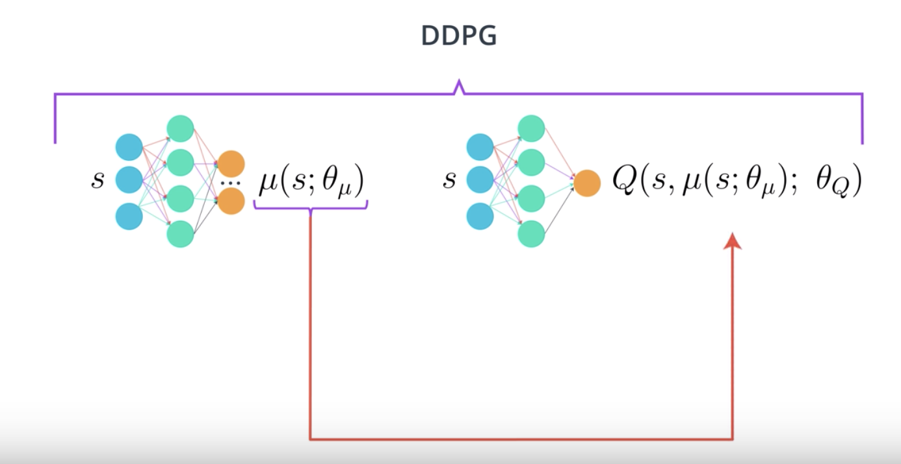
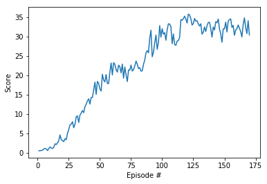

# Project Report

### Algorithm

This project uses Deep Deterministic Policy Gradient (DDPG) and 20 agents training simultaneously.



Key features:

* DDPG is basically Deep Q-Learning for continuous action space.
* 2 neural networks - **actor** and **critic**.
* **actor** approximates _deterministic_ policy.
* **critic** approximates action-value function.
* both actor and critic use regular and target weights (so it's technically 4 networks, not 2). We train regular weights, and use target weights for predictions. 
* instead of updating target weights every 10,000 steps, we slowly blend regular weights into target weights at each step (**Soft Update Strategy**).
* The critic is learned using the Bellman equation as in Q-learning.
* The actor is learned using the policy gradient.
* **actor and critic input** is the environment state - 33 variables corresponding to position, rotation, velocity, and angular velocities of the arm.
* **actor output** is a vector with four numbers, corresponding to torque applicable to two joints. Every entry in the action vector should be a number between -1 and 1 (hence tanh as activation function for the output layer).
* **critic output** is the Q-value
* **Experience Replay:** a sequence of experience might be highly correlated. To avoid this, we keep track of a replay buffer (which is a collection of tuples `(state, action, reward, next_state)`) and using experience replay to sample from the buffer at random.
* to make learning process more stable, the weights are updated 10 times after every 20 timesteps, instead of 20 times at every timestep.

DNN Layers (Actor):

* **input layer**: 33 nodes (environment state size)
* **hidden layer**: 400 nodes, ReLU
* **hidden layer**: 300 nodes, ReLU
* **output layer**: 4 nodes, Tanh (number of available actions)

DNN Layers (Critic):

* **input layer**: 33 nodes (environment state size)
* **hidden layer**: 400 nodes + action size, ReLU
* **hidden layer**: 300 nodes, ReLU
* **output layer**: 1 node

Hyperparameters:

* **replay buffer size**: `10,000` - _max number of experiences to store in the replay buffer._
* **batch size**: `128` - _how many random experiences to pick from the replay buffer._
* **actor learning rate**: `0.0001` - _controls how much we are adjusting the weights of the network._
* **critic learning rate**: `0.001` - _controls how much we are adjusting the weights of the network._
* **discount (Gamma)**: `0.99` - _determines the importance of future rewards: `1` - all future rewards are important, `0` - only immediate reward is important._
* **soft update (Tau)**: `0.001`
* **Ornstein-Uhlenbeck noise parameters:** `theta = 0.15`, `sigma = 0.2`

### Training



```
Episode 10  Score: 1.51     Average Score: 0.86
Episode 20  Score: 3.14     Average Score: 1.68
Episode 30  Score: 7.36     Average Score: 3.03
Episode 40  Score: 13.40    Average Score: 4.92
Episode 50  Score: 16.48    Average Score: 7.08
Episode 60  Score: 20.08    Average Score: 9.12
Episode 70  Score: 22.12    Average Score: 10.93
Episode 80  Score: 22.86    Average Score: 12.25
Episode 90  Score: 29.52    Average Score: 13.56
Episode 100 Score: 32.02    Average Score: 15.11
Episode 110 Score: 27.91    Average Score: 18.11
Episode 120 Score: 33.47    Average Score: 21.07
Episode 130 Score: 32.69    Average Score: 23.91
Episode 140 Score: 29.84    Average Score: 26.06
Episode 150 Score: 31.98    Average Score: 27.70
Episode 160 Score: 32.00    Average Score: 29.04
Episode 170 Score: 30.40    Average Score: 30.07

Problem solved after 170 epsisodes!! Average score: 30.07
```

### Results

Random agent


Smart agent (after training)


### Future ideas

*  PPO, A3C, or D4PG algorithms might work better for distributed training.
